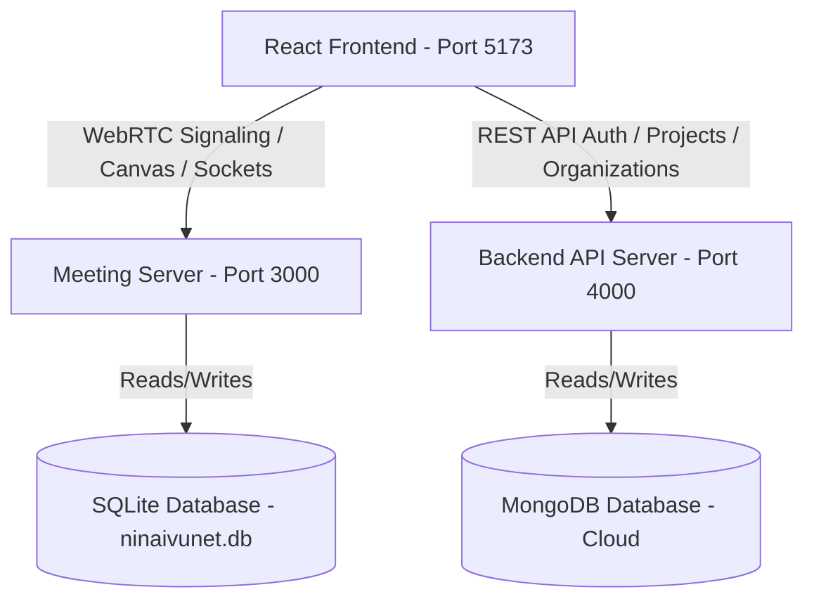

# Architecture Blueprint � NinaivuNet AI

This document details the software architecture, design patterns, and systemic workflows of NinaivuNet AI 3.0.

## ??? Architectural Overview
NinaivuNet AI uses a decoupled **Multi-Server Micro-Monolith Architecture** to achieve high concurrency, clean concerns separation, and local data isolation.

### 1. Root Meeting Server (Port 3000)
- **WebRTC Signaling**: Organizes mesh-topology video/audio connection streams over Socket.io.
- **SQLite Database Interface**: Handles meeting-scoped datasets (transcripts, decisions, vectors, attendance, tasks).
- **Audio Capturing Engine**: Gathers isolated participant-level microphone audio uploads to avoid diarization cost.
- **AI Pipelines**: Coordinates local Python execution workers for Speech-to-Text and NLP models.

### 2. Backend API Server (Port 4000)
- **MongoDB Operations**: Manages persistent tenant identity records (organizations, departments, users, access rules).
- **Authentication**: JWT token pair lifecycle management and Passport Google OAuth integration.
- **Security Hardening**: Includes Helmet headers, rate-limiting, and PII protection filters.

---

## ?? Core Design Patterns

### 1. Service-Repository Pattern
Deconstructs business rules and database scripts to prevent tight coupling.
- **Repository Layer**: Encapsulates raw database queries (`sqliteRepository.js`, `mongoRepository.js`).
- **Service Layer**: Manages procedural logic (audio decryption, LLM summary tasks, SMTP alerts dispatch).
- **Controller Layer**: Inspects schemas, validates parameters, and returns response.

### 2. Concurrency-Controlled Task Queue
- To prevent heavy Python whisper processes or remote LLM API calls from stalling Express event loops, execution tasks are pushed into a sequential async queue (`taskQueue.js`).

### 3. Caching Layer with Failover Cache
- A centralized Redis manager caches localized text values, meeting lists, and search answers. If connection drops, it automatically redirects requests to an in-memory cache fallback.
